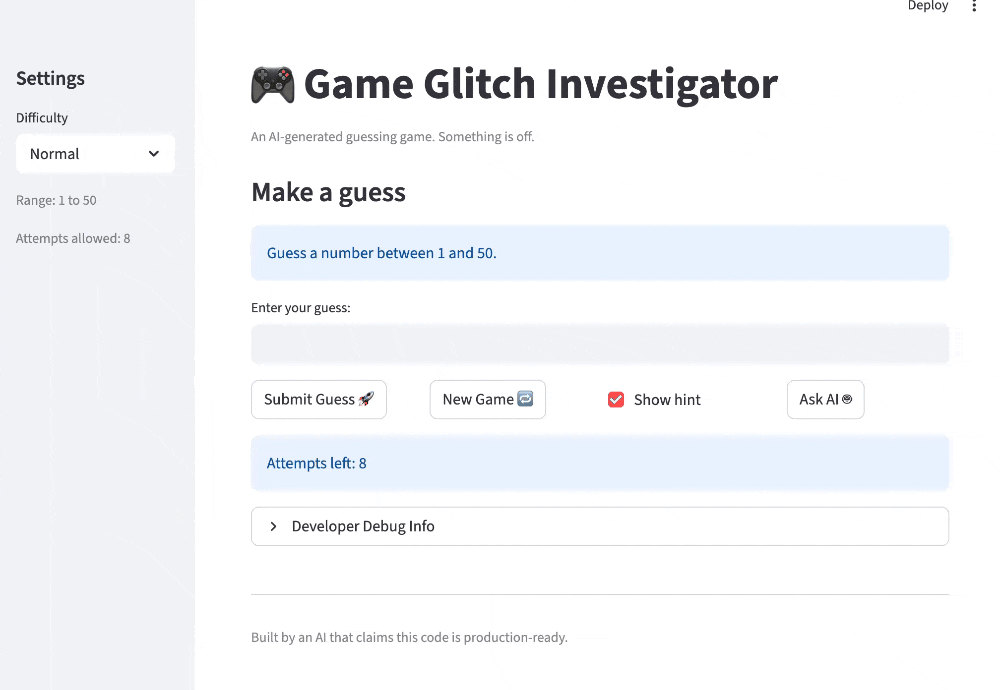
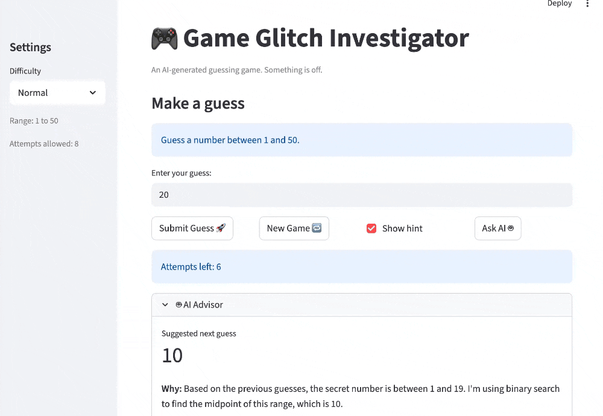

# 🤖 AI-Enhanced Number Guesser

> *An interactive number guessing game with AI-powered suggestions, built with Streamlit and Google Gemini*

## Base Project

This repository extends the original **Game Glitch Investigator: The Impossible Guesser** Streamlit project. The base game focused on fixing session-state bugs, hint direction bugs, and scoring/state reset issues; this version adds an AI advisor, evaluator guardrails, a full demo script, and expanded documentation.

## 🎯 Project Overview

### What This Project Does

**AI-Enhanced Number Guesser** is a Streamlit-based guessing game that demonstrates AI integration in a real application. Players try to identify a randomly selected number within a given range by making intelligent guesses, receiving hints, and (optionally) asking an AI advisor for suggestions using optimal binary search strategies.

### Core Features

- **🎮 Interactive Game**: Three difficulty levels (Easy: 1-20, Normal: 1-50, Hard: 1-100)
- **💡 Smart Hints**: Correct directional guidance ("Go Higher" / "Go Lower")
- **🤖 AI Advisor**: Uses Google Gemini API with tool calling for optimal suggestions
- **📊 Scoring System**: Rewards efficient guessing; penalties for wrong guesses
- **🛡️ Built-in Validation**: Input guardrails, output validation, state consistency checks
- **📈 Progress Tracking**: Maintains game history and attempts counter

### New AI Feature: Smart Number Guesser

Instead of guessing randomly, players can click **"Ask AI 🤖"** to get:
1. **Suggested next guess** based on binary search algorithm
2. **Search space analysis** (narrowed valid range)
3. **Step-by-step reasoning** from the AI advisor
4. **Guaranteed optimal strategy** using mathematical principles

---

## 📋 System Architecture

For detailed architecture documentation, see [ARCHITECTURE.md](ARCHITECTURE.md).
The diagram is also exported at [assets/system-architecture.svg](assets/system-architecture.svg).

---

## 🚀 Installation & Setup

### Prerequisites

- Python 3.8+
- Google Gemini API key (for AI features)
- pip or conda

### Step 1: Clone and Navigate

```bash
cd applied-ai-system-project4
```

### Step 2: Install Dependencies

```bash
pip install -r requirements.txt
```

**What gets installed:**
- `streamlit` - UI framework
- `altair` - charting library
- `pytest` - testing framework
- `google-genai` - Gemini API client
- `python-dotenv` - environment variable management

### Step 3: Set Up Google API Key

Create a `.env` file in the project root:

```bash
echo "GOOGLE_API_KEY=your_google_api_key_here" > .env
```

To get a Google API key:
1. Go to [Google AI Studio](https://aistudio.google.com/app/apikey)
2. Create a new API key
3. Copy and paste into `.env`

### Step 4: Run the Application

```bash
python -m streamlit run app.py
```

The app opens at `http://localhost:8501`

---

## 🎬 Demo

These GIFs show the AI suggestion flow in action.

| Demo 1 | Demo 2 |
| --- | --- |
|  |  |

---

## 🎮 How to Play

### Basic Gameplay

1. **Select Difficulty**:
   - Easy: 1-20 (6 attempts)
   - Normal: 1-50 (8 attempts)  
   - Hard: 1-100 (5 attempts)

2. **Make Guesses**: Enter a number in the input field

3. **Read Hints**:
   - 📉 "Go LOWER" = your guess is too high
   - 📈 "Go HIGHER" = your guess is too low
   - 🎉 "Correct!" = you won!

4. **Track Your Score**:
   - Win on attempt N: `100 - 10*(N+1)` points (minimum 10)
   - Wrong guess: -5 points

### Using the AI Advisor

Click **"Ask AI 🤖"** to get a smart suggestion:

```
AI Advisor shows:
  • Suggested next guess (using binary search)
  • Why this is optimal
  • Narrowed search range analysis
  • Step-by-step reasoning
```

**Example Session**:
```
Start: Range [1, 50]
Guess 25 → Too Low → Range narrows to [26, 50]
Guess 37 → Too Low → Range narrows to [38, 50]
Guess 45 → Too High → Range narrows to [38, 44]
AI suggests: 41 (midpoint of valid range)
Guess 41 → Too Low → Range narrows to [42, 44]
Guess 43 → Found! (5 attempts)
```

---

## 📊 Sample Input/Output Examples

### Example 1: Easy Game with AI Assistance

**Input**:
- Difficulty: Easy
- Guesses: 10, 18, 16, 15

**Output**:
```
Guess 1: 10
  Result: Too Low
  Message: 📈 Go HIGHER!
  Score: 0 → -5 (wrong guess)

Guess 2: 18
  Result: Too High
  Message: 📉 Go LOWER!
  Score: -5 → -10

Guess 3: 16
  Result: Too High
  Message: 📉 Go LOWER!
  Score: -10 → -15

Guess 4: 15
  Result: Win! 🎉
  Final Score: -15 → 35 (won in 4 attempts)
```

### Example 2: Normal Game with AI Suggestions

**Setup**: Normal difficulty, Range [1, 50], Secret: 42

**Workflow**:
```
Player Guess 25 → Too Low
  AI Analysis: Valid range narrows to [26, 50]

Player Guess 37 → Too Low
  AI Analysis: Valid range narrows to [38, 50]

Player Clicks "Ask AI 🤖"
  AI Suggests: 44 (midpoint of [38, 50])

Player Guess 44 → Too High
  AI Analysis: Valid range narrows to [38, 43]

Player Guess 42 → Win! 🎉
  Final Score: 20 points
  Total Attempts: 5
```

### Example 3: Input Validation

**Invalid Inputs (Easy mode, range 1-20)**:
```
Input: 0
Output: ❌ "Guess must be between 1 and 20. Got 0."

Input: 25
Output: ❌ "Guess must be between 1 and 20. Got 25."

Input: "abc"
Output: ❌ "That is not a number."

Input: (empty)
Output: ❌ "Enter a guess."
```

---

## 🧪 Testing & Validation

### Run the Demo

A comprehensive demonstration with multiple scenarios:

```bash
python3 demo.py
```

**Demo includes**:
- 5 complete game scenarios
- Input validation tests
- Game state consistency checks
- Scoring verification
- AI suggestion analysis
- Output: Full validation report

### Run Tests

The project includes pytest tests for core game logic:

```bash
pytest tests/
```

**Test Coverage**:
- ✓ Attempt counter initialization
- ✓ Hint direction correctness
- ✓ Win/loss detection
- ✓ Scoring calculations
- ✓ State management
- ✓ Type handling (int, string, etc.)

### Play the Game Manually

```bash
python -m streamlit run app.py
```

Then in the UI:
1. Try different difficulty levels
2. Use "Developer Debug Info" tab to verify secret number
3. Test "Ask AI 🤖" button with various game states
4. Play multiple games and verify scoring

---

## 🛡️ Guardrails & Reliability

The system includes multiple layers of validation:

### 1. Input Guardrails
- Number range validation
- Type checking (integers only)
- Difficulty level validation

### 2. Output Guardrails (AI Suggestions)
- Suggested guess is within valid game range
- Guess hasn't been tried before
- Bounds are mathematically consistent
- Binary search midpoint validation

### 3. Game State Validation
- Secret number within valid range
- Attempt count consistency
- Score bounds checking
- History integrity

### 4. Hint Verification
- Autocorrect backward hints
- Verify outcome matches comparison
- Check message consistency

For details, see [evaluator.py](evaluator.py).

---

## 🔍 Project File Structure

```
applied-ai-system-project4/
├── app.py                 # Main Streamlit application
├── logic_utils.py         # Core game logic (pure functions)
├── ai_advisor.py          # Gemini API integration & tool calling
├── evaluator.py           # Guardrails & validation layer
├── demo.py                # End-to-end demonstration script
├── ARCHITECTURE.md        # Detailed system architecture
├── README.md              # This file
├── reflection.md          # AI collaboration reflection
├── requirements.txt       # Python dependencies
├── .env                   # Environment variables (create this)
├── assets/                # Image assets
└── tests/
    └── test_game_logic.py # Pytest unit tests
```

---

## 💡 Key Features & Implementation

### Feature 1: Correct Hint Direction ✓
- Hints accurately reflect whether guess is too high/low
- All tests in `test_game_logic.py` pass

### Feature 2: Stable Game State ✓
- Secret number persists across Streamlit reruns
- Session state properly managed
- New game resets all variables correctly

### Feature 3: Accurate Scoring ✓
- Win bonuses: 100 - 10*(attempt+1), min 10
- Wrong guess penalties: -5 each
- Scores can accumulate across games

### Feature 4: AI-Powered Suggestions ✓
- Uses Gemini's function calling (tool use)
- Implements binary search strategy
- Provides step-by-step reasoning
- Handles API errors gracefully

### Feature 5: System Reliability ✓
- All inputs validated before processing
- All outputs checked for consistency
- State validation prevents impossible scenarios
- Comprehensive error handling

---

## 📚 Additional Resources

- **Architecture Deep Dive**: See [ARCHITECTURE.md](ARCHITECTURE.md)
- **System Diagram Asset**: [assets/system-architecture.svg](assets/system-architecture.svg)
- **Model Card / Reflection**: [model_card.md](model_card.md)
- **Demo Scenarios**: Run `python3 demo.py` for 5 complete examples
- **Unit Tests**: `pytest tests/` for core logic validation
- **AI Reflection**: [reflection.md](reflection.md) - AI collaboration insights

---

## 🎓 Learning Outcomes

Through this project, you will understand:

1. **AI Integration**: How to safely integrate LLMs into applications
2. **Agent Patterns**: Tool-calling for structured, verifiable AI outputs  
3. **Streamlit State**: How session state works with React-style reruns
4. **Guardrails**: Pattern for validating AI suggestions before display
5. **Testing**: Unit tests, integration tests, and manual game testing
6. **Game Design**: Simple but engaging game mechanics
7. **Scoring Systems**: How to reward efficiency and penalize mistakes

---

## 🚀 Running the Complete System

```bash
# Step 1: Install
pip install -r requirements.txt

# Step 2: Configure API key
echo "GOOGLE_API_KEY=sk_..." > .env

# Step 3: Run tests
pytest tests/

# Step 4: Run demo
python3 demo.py

# Step 5: Play!
python -m streamlit run app.py
```

---

## 📝 Notes

- First run may take a moment as Streamlit initializes
- AI suggestions require valid GOOGLE_API_KEY
- Game state is per-session (no persistence between browser closes)
- Score persists within a session across multiple games
- "Developer Debug Info" tab shows secret for debugging

---

## 🤝 Contributing

This is an educational project. Improvements welcome!

---

**Created as part of an AI system integration project. Built with ❤️ using Streamlit and Gemini.**
